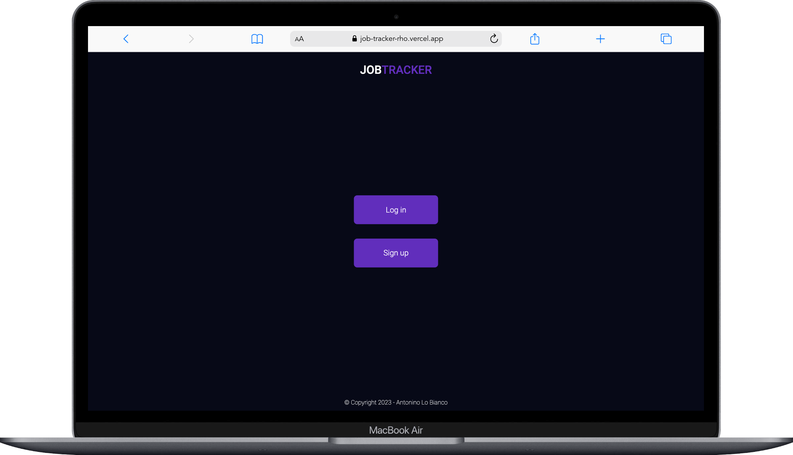

# JOBTRACKER

---

As part of a BACKEND project, I developed a web application to manage job and work placement searches. This application uses CRUD concept (Create, Read, Update and Delete). It also uses JWT tokens to authenticate users. 

For this project, the aim wasn't really to focus on the design of the application, but on how well it worked. I've created an application that allows me to list all my job and work placement searches.  The application is linked to my MongoDB database. On this purely backend project, my best friend was none other than POSTMAN. 

I'll leave you the link to the application here : 
https://job-tracker-rho.vercel.app/

- 📫 MAIL:  **antonino.lobianco@outlook.com**
  
##### Here are some demos...

---
 
 

<h2 align="center">DESKTOP</h2>

 
 

    

 
 

    

 
 

    

 
 

    

 
 

    

 
 

    

 
 

    

 
 

    

 
 

    

 
 

    

 
 
 
 

---

 
 

<h2 align="center">MOBILE</h2>

 
 

    

 
 

    

 
 

    

 
 

    

 
 

    

 
 

    

 
 

    

 
 

    

 
 

    

 
 

    

